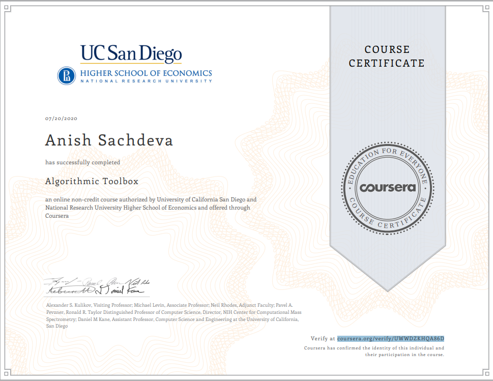

# Algorithmic Toolbox - Coursera
__By University of California, San Diego, National Research University Higher School of Economics__

This course is part of a larger _Data Structures and Algorithms_ specialization.

## Index
| Week | Links | 
|:----:|:-----:|
| [Week 1](#week-1) | [[Quizzes]](#quizzes) ⭐ [[Programming Assignments]](#programming-assignments) |
| [Week 2](#week-2) | [[Quizzes]](#quizzes-1) ⭐ [[Programming Assignments]](#programming-assignments-1) |
| [Week 3](#week-3) | [[Programming Assignments]](#programming-assignments-2) |
| [Week 4](#week-4) | [[Programming Assignments]](#programming-assignments-3) |
| [Week 5](#week-5) | [[Programming Assignments]](#programming-assignments-4) |
| [Week 6](#week-6) | [[Programming Assignments]](#programming-assignments-5) |

## Week 1 [📄](src/week1/week1_programming_challenges.pdf)
### Quizzes
- [Solving Programming Challenges](src/week1/solving-programming-challenges.md)

### Programming Assignments 
- [Sum of 2 Numbers (Java)](src/APlusB.java)
- [Max Pairwise Product (Java)](src/MaxPairwiseProduct.java)

## Week 2 [📄](src/week2/week2-algorithmic-warmup.pdf)
### Quizzes
- [Logarithms: Practice Quiz](src/week2/logarithms-quiz.md)
- [Big-O: Practice Quiz](src/week2/big-o-quiz.md)
- [Growth Rate: Practice Quiz](src/week2/growth-rate-quiz.md)

### Programming Assignments
- [Fibonacci Number (Java)](src/Fibonacci.java)
- [Last Digit of Large Fibonacci Number (Java)](src/FibonacciLastDigit.java)
- [Greatest Common Divisor (Java)](src/GCD.java)
- [Least Common Multiple (Java)](src/LCM.java)
- [Fibonacci Number Again (Java)](src/FibonacciHuge.java)
- [Last Digit of Sum of Fibonacci Numbers](src/FibonacciSumLastDigit.java)
- [Last Digit of The Sum of Fibonacci Digits Again](src/FibonacciPartialSum.java)
- [Last Digit of the Sum of Squares of Fibonacci Numbers](src/FibonacciSumSquares.java)

## Week 3 [📄](src/week3/week3-greedy-algorithms.pdf)
### Programming Assignments
- [Money Change (Java)](src/Change.java)
- [Maximum Loot Value/Fractional Knapsack (Java)](src/FractionalKnapsack.java)
- [Car Fueling (Java)](src/CarFueling.java)
- [Maximum Advertisement Revenue (Maximum Dot Product) (Java)](src/DotProduct.java)
- [Maximum Advertisement Revenue (Maximum Dot Product) (Python)](python/week-3/max-dot-product.py)
- [Collecting Signatures (Covering Segments by Points) (Java)](src/CoveringSegments.java)
- [Maximum Number of Prizes (Different Summands) (Java)](src/DifferentSummands.java)
- [Maximum Salary (Largest Number) (Java)](src/LargestNumber.java)
- [Maximum Salary (Largest Number) (Python)](python/week-3/largest-number.py)

## Week 4 [📄](src/week4/week4-divide-and-conquer.pdf)
### Programming Assignments
- [Binary Search (Java)](src/BinarySearch.java)
- [Majority Element (Jva)](src/MajorityElement.java)
- [Improving QuickSort (Java)](src/Sorting.java)
- [Inversions (Java)](src/Inversions.java)
- [Organizing a Lottery (Python)](python/week-4/points_and_segments.py)
- [Closest Points (Python)](python/week-4/closest_points.py)

## Week 5 [📄](src/week5/week5-dynamic-programming1.pdf)
### Programming Assignments
- [Money Change Again (Python)](python/week-5/money_change_again.py)
- [Primitive Calculator (Python)](python/week-5/primitive_calculator.py)
- [Edit Distance (Python)](python/week-5/edit_distance.py)
- [Longest Common Subsequence of 2 Sequences (Java)](src/LongestCommonSubsequence.java)
- Longest Common Subsequence of 3 Sequences

## Week 6 [📄](src/week6/week6_dynamic_programming2.pdf)
### Programming Assignments
- Maximum Amount of Gold
- [Partitioning Souvenirs](python/week-6/partition_souvegnirs.py)
- [Maximum Value of an Arithmetic Expression](python/week-6/max_value_arithmetic_expression.py)

## [Certificate](http://coursera.org/verify/UWWDZKHQA86D)

